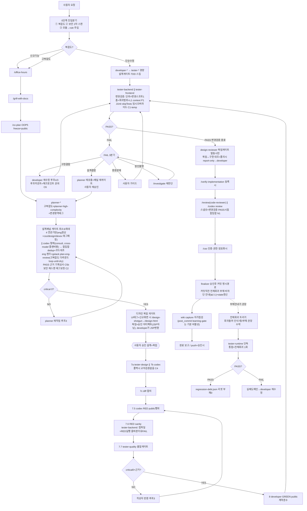

# harness-setup

**Claude Code(AI 코딩 에이전트)를 팀 개발 표준처럼 규율하는 오케스트레이션 하네스.**

AI가 세션마다 제멋대로 구현하지 않도록, 사람 팀의 개발 프로세스(요구사항 상세화 → 설계 리뷰 → TDD → 코드리뷰 → 문서화)를 `.claude` 디렉터리의 규칙·에이전트·게이트로 구조화했다. 새 프로젝트에 `.claude`로 클론하면 동일한 개발·검토·문서화 워크플로를 그대로 재사용한다.

핵심은 **게이트** — 각 단계가 통과 기준을 넘어야 다음으로 간다:
- **설계 패널 게이트**: 승인 전, 다중 페르소나(eng·보안·설계) + 타모델(codex) 교차검증으로 계획을 비평
- **TDD 합의**: 테스트 작성자 ≠ 구현자 ≠ 검증자 분리 — AI가 자기 테스트를 통과시키려 구현을 왜곡하는 것을 기계 차단
- **FAIL 3분기**: 실패를 구현결함/설계결함/환경문제로 분류해 각각 다른 복구 경로
- **자기개선 루프**: 운영 중 겪은 실패를 회고→규칙화해 하네스 자체를 버전업 (현재 v3.53.2)

## 주요 목적
- AI 개발 세션의 작업 규칙 표준화(세션 간 일관성)
- 설계·구현·테스트·리뷰 단계 분리 + 게이트 기반 품질 강제
- 프로젝트 문맥·의사결정의 세션 간 보존
- 반복 개발 절차 자동화 + 회고 기반 자기개선

## 워크플로 흐름

0단계 진입분기(복잡도·보안 2차 스캔·모듈→rule 주입) → 3트랙(단순수정/신규기능/고복잡도) → 설계패널 게이트 → 사용자 승인 → TDD 합의 → 변경검증(tester-backend/frontend) → review → finalizer. 전체회귀(tester-runtime)는 매 구현 강제 체인에서 분리돼 부채/수동("회귀 돌려") 트리거로만 실행.



> 흐름 변경 시 위 mermaid 블록을 갱신한다 (단일 소스).

## 설치 (새 프로젝트에 클론)

프로젝트 루트에서 실행:

```bash
git clone https://github.com/JungwooKim1271011706/harness-setup.git .claude
```

> `git clone <url> <대상디렉터리>` — 마지막 인자를 `.claude`로 주면 그 이름으로 받는다.
> `.claude`가 이미 있으면 비우거나 백업 후 클론한다 (git clone은 빈 디렉터리 필요).

특정 브랜치를 받고 싶으면 `-b <브랜치명>`:

```bash
git clone -b <브랜치명> https://github.com/JungwooKim1271011706/harness-setup.git .claude
```

미지정 시 기본 브랜치(main, 안정 버전)를 받는다. 개발/실험 브랜치를 쓸 때만 `-b`로 지정.

## 클론 후 셋업 (필수 3단계)

### 1. 프로젝트 루트가 `.claude`를 추적하지 않게
`.claude`는 자체 git 레포다. 상위 프로젝트 레포가 중복 추적하지 않도록 루트 `.gitignore`에 추가:

```bash
echo "/.claude/" >> .gitignore
```

### 2. 프로젝트 코딩 규칙 생성
`rules/`는 프로젝트별 산출물이라 클론 시 비어 있다. 프로젝트 소스를 분석해 생성:

```
/rule-maker
```

### 3. 프로젝트 설정값 교체
`CLAUDE.md`의 `Harness Configuration` 섹션 값(projectName, frontendRoot/backendRoot, modules, examples 등)을 새 프로젝트에 맞게 수정한다. `agents/`는 이 변수만 참조하므로 직접 수정하지 않는다.

### 4. gstack 설치 (글로벌 의존 — plan-*-review·계획리뷰·context-save 등)
하네스는 gstack 스킬을 repo에 vendoring하지 않고 글로벌 설치에 의존한다. 미설치 시 설계패널 plan-*-review 렌즈·`/office-hours`·`/cso`·`/context-save` 등이 동작하지 않는다(세션 시작 시 `session-check.sh`가 안내).

```bash
git clone --single-branch --depth 1 https://github.com/garrytan/gstack.git ~/.claude/skills/gstack
cd ~/.claude/skills/gstack && ./setup --no-prefix
```

`--no-prefix`는 필수 — 하네스가 `/office-hours`·`/plan-eng-review` 같은 **짧은 이름**으로 호출한다(기본 `--prefix`는 `/gstack-*`로 등록돼 빗나감).

### 5. (선택) 공식 OpenAI codex 플러그인 — 사용자 주도 리뷰용
codex provider는 **역할 분리**(A2)다: **자동 흐름**(TDD·`/codex review` 단계)은 gstack `/codex`가 담당하고, **사용자가 임의 시점에 직접** 코드리뷰를 원하면 공식 플러그인이 더 깔끔하다(`/codex:review`, `/codex:adversarial-review`). 공식 슬래시는 `disable-model-invocation`이라 orchestrator가 자동 호출하지 않으므로 자동 흐름과 충돌하지 않는다.

```
/plugin marketplace add openai/codex-plugin-cc
/plugin install codex@openai-codex
/codex:setup   # codex CLI·인증 점검
```

## 업데이트 (마스터 → 프로젝트)

하네스 개선은 이 레포 `main`에 누적된다. 프로젝트에서 최신 반영:

```bash
git -C .claude pull origin main
```

외부 제3자 스킬 동기화는 `bash .claude/skills/sync-skills.sh` (현재 grill-with-docs 1개). 자체 스킬은 repo가 SSOT라 sync 대상 아님. gstack 스킬은 `gstack-upgrade`로 갱신 — session-check.sh가 staleness 안내.

## 하네스 자기개선 루프

하네스는 스스로를 고도화하는 4층 루프를 갖는다. **발견·초안은 자동, 적용은 사람 승인**(거버넌스 불변식 = 하네스 자동수정 금지).

| 단계 | 장치 | 트리거 |
|------|------|--------|
| ① 발견 | `workflows/harness-feature-scan.js` (CC 신기능·웹 모범사례 조사 → 백로그) | 30일 주기 넛지 또는 "기능스캔 돌려" |
| ② capture | `wiki/` 운영지식 capture (`wiki/_schema.md` SSOT) | post_commit 자가점검 |
| ③-입력 | `/harness-check` 스킬 (운영 고통 신호 → 개선 후보 → ③에 위임) | 워크플로 종료 시 자동(고통 감지) / "하네스 자가 점검" |
| ③ 규칙화 | `/harness-retro` 스킬 (회고 → 분류·라우팅·초안·승인·적용) | "하네스 회고 반영" / `/harness-check` 위임 / 회고 텍스트 |
| ④ 전파 | `VERSION`/`CHANGELOG` + drift 탐지 + `git -C .claude pull` | session-check 훅 |

①·③은 백로그(`agent-memory/orchestrator/project_harness_improvement_backlog.md`)를 단일 원장으로 공유한다. ③의 입력은 사람이 회고를 가져오거나(`/harness-retro`), 하네스가 자기 운영 고통을 스스로 탐지해(`/harness-check`) 자동 생성한다 — **탐지·초안은 자동, 적용은 사람 승인**.

### 회고 inbox (transport — check 드롭 / retro 드레인)

③의 입력을 **실작업 세션 → 적용 세션**으로 복붙 없이 나르는 머신글로벌 드롭박스다. 실작업 세션(worktree)의 `.claude`는 제품 gitlab repo가 vendoring한 파일이라 harness-setup remote가 없어 **거기선 적용·push 불가** — 적용은 harness-setup **단독 clone(= dev clone, origin=harness-setup)**에서만 가능하다.

- **드롭(생성)**: `/harness-check`가 후보를 `~/.claude/harness-retro-inbox/<UTC-ts>__<slug>.md`로 자동 기록(운반, 적용 아님). 두 repo 어디도 안 건드리는 중립지대.
- **드레인(적용)**: dev clone에서 inbox pending을 전부 읽어 분류·승인·적용하고, 처리분을 `applied/`·`rejected/`로 옮긴다. ⚠ **dev clone은 `/harness-retro` 슬래시가 미등록**이다 — 클코는 슬래시 스킬을 `.claude/skills/`에서 등록하는데 dev clone은 harness가 **repo 루트**(`skills/...`)라 그 경로가 없다(슬래시는 소비자 세션의 vendored `.claude/skills/`에서만 뜸). dev clone에선 **"하네스 inbox 처리해줘"** 요청 = Claude가 `skills/harness-retro/SKILL.md` 절차를 따라 실행한다(슬래시 호출 아님, 결과 동일).
- **알림(설치 필요)**: dev clone은 자체 `.claude/`가 없어 repo 훅이 안 걸린다. 매 프롬프트마다 pending을 알리려면 **글로벌** `~/.claude/settings.json`에 `UserPromptSubmit` 훅으로 `hooks/harness-inbox-nudge.sh`를 등록한다(머신 1회 셋업). 글로벌이라 모든 세션서 돌지만 **origin=harness-setup(dev clone)일 때만** 출력 — 제품 세션은 침묵.
  ```json
  // ~/.claude/settings.json  (machine-global, repo 밖 — 같은 머신 가정)
  "UserPromptSubmit": [
    { "hooks": [ { "type": "command",
        "command": "bash \"<dev-clone-절대경로>/hooks/harness-inbox-nudge.sh\"", "timeout": 10 } ] }
  ]
  ```
- **한계(정직)**: inbox는 같은 머신 공유 전제(`~/.claude`). 크로스머신이면 비공유 → 수동 복붙 폴백.

## 버전 관리

하네스는 `VERSION`(semver `MAJOR.MINOR.PATCH`)으로 동작 버전을 관리한다.

- **SSOT**: `.claude/VERSION`. 변경 이력은 `CHANGELOG.md`.
- **drift 안내**: 세션은 시작 시점 하네스(특히 agent md·settings)를 메모리에 들고 간다. 세션 도중 하네스가 갱신되면(다른 세션이 pull/커밋) `session-check.sh` 훅이 compact/resume 시 버전 차이를 감지해 **세션 재시작을 안내**한다(MAJOR=필수, 그 외=권장). 자동 변형 없음 — 순수 안내.
- **bump 주체**: 하네스 **동작**(agent md 규칙·훅·settings·스킬)을 바꾸는 커밋에서 `finalizer`가 VERSION bump + CHANGELOG 갱신 + `sync-skills.sh` 동반 실행. 순수 문서(README/순수 설계 docs)만 바꾼 커밋은 bump 대상 아님. ⚠ 단 `docs/playbook-*.md`·`docs/routing-map.md`는 orchestrator.md에서 분리한 **동작 문서**(라우팅 뇌 외부화분)라 bump 대상 — `finalizer`의 "분리 문서 정합성 점검"이 동기 강제.
- 설계 전문: `docs/harness-versioning.md`.

## 구조

| 경로 | 내용 | 추적 |
|------|------|------|
| `agents/` | 오케스트레이터·planner·developer·tester·reviewer(code-reviewer)·finalizer | track |
| `skills/` | 자체 스킬 + sync 스크립트 (gstack 스킬은 미러 안 함 — 글로벌 의존, §셋업 4) | track |
| `hooks/` | 세션 점검 훅 | track |
| `scripts/` | 유틸 스크립트 — `worktree-status.sh`(온디맨드 워크트리×기능 대시보드, 읽기전용), `link-worktree-claude.sh`(전역 SessionStart 훅용 — 워크트리에 `.claude` 자동 junction) | track |
| `settings.json` | 공유 설정 | track |
| `VERSION` · `CHANGELOG.md` | 하네스 버전(semver) + 변경 이력 | track |
| `docs/` | 설계 문서(ADR·하네스 버전관리 등) + **orchestrator 분리 동작문서**(`playbook-harness-ops/design-mode/tdd.md`·`routing-map.md` — v3.2.0, on-demand Read) | track |
| `wiki/` | 하네스 운영 지식·gotcha (엔티티 페이지+`[[링크]]`, 카파시 LLM wiki 패턴). 작성/라우팅 규칙은 `wiki/_schema.md` | track |
| `rules/` | 프로젝트별 코딩 규칙 (rule-maker 생성) | ignore |
| `agent-memory/` | 프로젝트별 메모리 (auto-memory, 머신로컬·휴대 안 됨) | ignore |
| `settings.local.json` | 로컬 권한/secret | ignore |
| `state/` | 머신로컬 세션 스탬프·스캔 산출 | ignore |
