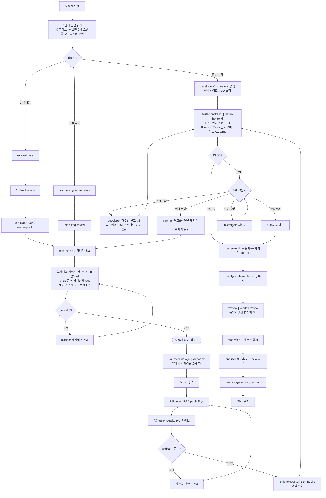

# 하네스 흐름도 (v3.2 + 감사보강)

> 자동 갱신 대상. 하네스 변경 시 이 mermaid 소스를 고치고 `harness-flow.png` 재렌더.
> 표식: P1 테스트레이어링 · C1-temp skipTests · C2 보안재스캔 · C4 codex폴백 · C5b 기계심사 · C6 루프영속 · N1 리뷰종합

```mermaid
flowchart TD
  REQ["사용자 요청"] --> S0["0단계 진입분기<br/>① 복잡도 ② 보안 2차 스캔 ③ 모듈→rule 주입"]
  S0 --> CPX{복잡도?}

  CPX -->|단순수정| SIMP["developer-* → tester-* 경량<br/>설계게이트·TDD 스킵"]
  SIMP --> POST
  CPX -->|신규기능| NF1["/office-hours"]
  CPX -->|고복잡도| HC1["planner-high-complexity"]

  NF1 --> NF2["/grill-with-docs"] --> NF3["/co-plan OOP5 freeze=public"] --> PL["planner-* +변경영역태그"]
  HC1 --> HCE["/plan-eng-review"] --> PL
  PL --> GATE["설계패널 게이트 신규≥3/고복잡도≥4<br/>PASS 근거 기계심사 C5b<br/>보안 재스캔 태그보정 C2"]
  GATE --> CRIT{critical 0?}
  CRIT -->|NO| PLRE["planner 재작업 루프3"] --> GATE
  CRIT -->|YES| APV{{"사용자 승인 설계만"}}

  APV --> T7A["7a tester-design ∥ 7b codex<br/>폴백시 교차검증없음 C4"]
  T7A --> T7C["7c diff 합의"] --> T75["7.5 codex RED public행위"] --> T77["7.7 tester-quality 품질게이트"]
  T77 --> Q77{critical0+근거?}
  Q77 -->|NO| RET["작성자 반환 루프3"] --> T75
  Q77 -->|YES| T8["8 developer GREEN public계약준수"]
  T8 --> POST

  POST["tester-backend ∥ tester-frontend<br/>단위+변경스코프 P1<br/>JUnit skipTests 임시오버라이드 C1-temp"]
  POST --> PF{PASS?}
  PF -->|PASS| RT["tester-runtime 통합+전체회귀 1회 P1"]
  RT --> VER["/verify-implementation 등록시"] --> REV["/review ∥ /codex review<br/>동일스냅샷 합집합 N1"]
  REV --> CSO["/cso 인증·권한·암호화시"] --> FIN["finalizer 승인후 커밋 명시경로"]
  FIN --> LG["learning-gate post_commit"] --> DONE["완료 보고"]

  PF -->|FAIL| FB{FAIL 3분기}
  FB -->|구현결함| DEV["developer 재수정 루프n/3<br/>루프카운트=체크포인트 권위 C6"] --> POST
  FB -->|설계결함| DM["planner 재호출+패널 재게이트<br/>사용자 재승인"] --> PL
  FB -->|환경문제| EN["사용자 가이드"] --> RT
  FB -->|원인불명| INV["/investigate 재판단"] --> FB
```
